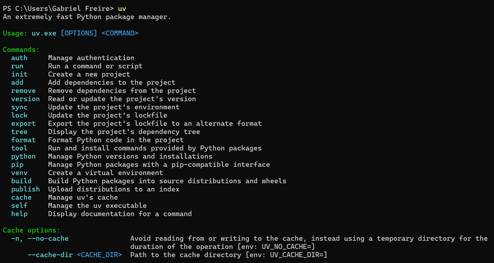

# DEFAULT TEMPLATE - STEPS TO CONFIG YOUR NEW REPOSITORY

## UV - install and configs steps

1. Install UV **(IF YOU DON'T HAVE THE UV INSTALLED YET)** 

    1.1. Open a PowerShell terminal as administrator and run the follow command:

        ```sh
        powershell -c "irm https://astral.sh/uv/install.ps1 | iex"
        ```

    1.2. Test the UV:

        ```sh
        uv
        ```

    - 1.2.1. The terminal will be something as:

        

    **Note:** If you already have the UV installed, skip to next session (2)

2. Configure the UV:

    2.1. Setup the UV and pre-commit from the pyproject.toml:

        ```sh
        uv sync
        ```

    2.2. Run the follow commands to config the pre-commit (YOU ONLY NEED DOING THIS IN THE FIRST TIME):

        ```sh
        uv run pre-commit install
        uv run pre-commit install --hook-type commit-msg
        ```

    2.3. Add a new dependencie:

        ```sh
        uv add DEPENDENCIE_NAME
        ```

    2.4. Run a script file:

        ```sh
        uv run SCRIPT_NAME.py
        ```